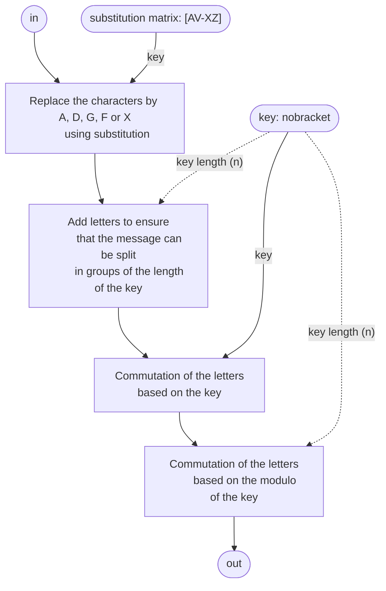
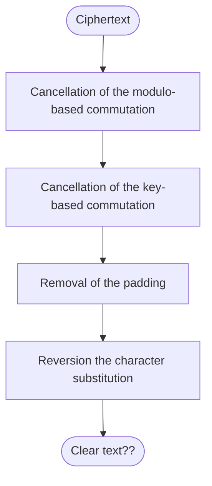

<details>
<summary>Original Challenge description 🇫🇷</summary>
<blockquote>
Il y a quelques mois Ernest a rencontré le Colonel Fritz Nebel, célèbre inventeur du cryptosystème ADFGX. Depuis, Ernst ne fait que l'utiliser pour écrire ses lettres. Allez-vous être capable de perser les secrets d'Ernest ?
Quelques indications :
 1) Pour le bien du challenge le message a été traduit en français.
 2) Une fois le message trouvé, veuillez insérer le flag sous le format suivant : {'NBCTF{LEMESSAGECACHE}'}
</blockquote>
</details>

<details open>
<summary>Challenge description 🇺🇸</summary>
<blockquote>
A few months ago, Ernest met Colonel Fritz Nebel, the famous inventor of the ADFGX cryptosystem. Since then, Ernst has been using it to write his letters. Will you be able to keep Ernest's secrets?
A few hints:
1) For the sake of the challenge, the message has been translated into French.
2) Once you've found the message, please insert the flag in the following format: {'NBCTF{THEHIDDENMESSAGE}'}
</blockquote>
</details>

# Write up

## Challenge inspection

### Script
A python script and a file named `output.txt` are provided with the challenge:
```py
### ADFGX cryptosystem
import re
from secret import substitution_matrix

letters = ["A", "D", "F", "G", "X"]

def part1(plaintext):
    ## characters substitution

    pre_ciphertext = ""
    for l in plaintext:
        tmp_row = substitution_matrix.index(l)//5
        tmp_col = substitution_matrix.index(l)%5

        pre_ciphertext = pre_ciphertext + letters[tmp_row] + letters[tmp_col]

    return pre_ciphertext

def part2(pre_ciphertext):
    key = "nobracket"

    ## index of the key in alphabetic order
    n = len(key)
    key_index = sorted(range(n), key=lambda i: key[i])

    ## adds padding to ensure that pre_ciphertext is a multiple of the key.
    while len(pre_ciphertext)%n != 0:
        pre_ciphertext = pre_ciphertext + "X"

    ## Column commutation
    ciphertext = ""
    for i in range(len(pre_ciphertext)//n):
        for j in key_index:
            ciphertext = ciphertext + pre_ciphertext[i*n + j]

    true_cipher = ""
    for i in range(n):
        for j, c in enumerate(ciphertext):
            if j%n == i :
                true_cipher = true_cipher + c

    return true_cipher

text = open("confidential.txt").read()

p = re.compile('[A-VX-Z]')

## Extract every chars known to the cryptosystem (A to V and X to Z)
plaintext = "".join(p.findall(text.upper()))

## characters substitution
pre_ciphertext = part1(plaintext)

## Column rearrangement
ciphertext = part2(pre_ciphertext)

print(ciphertext)

f = open("output.txt", "w")
f.write(ciphertext)
```

Okay... understanding this is gonna take some work.


let's see what we can guess from just looking what happens in this script:
### Assumptions
Judging from the code snippet `text = open("confidential.txt").read()` and `open("output.txt", "w")`, it appears to be the script that encrypted the message in `output.txt`.

the line `from secret import substitution_matrix` also appears to be importing an array from another file, probably containing the alphabet.

Judging by the fives in:
```py
tmp_row = substitution_matrix.index(l)//5
tmp_col = substitution_matrix.index(l)%5
```
we can probably assume that the array is supposed to represent a 5 by 5 grid.

We can deduce from this that our alphabet is probably only composed of 25 letters.
It is also stated in the comment `(A to V and X to Z)` that the cryptosystem does not support the letter `W`.

Based on the previous deductions, I'm assuming that `substitution_matrix` is a grid of 5 by 5 containing every letters of the alphabet except for `W`:
```py
substitution_matrix = [
	"A", "B", "C", "D", "E",
	"F", "G", "H", "I", "J",
	"K", "L", "M", "N", "O",
	"P", "Q", "R", "S", "T",
	"U", "V", "X", "Y", "Z"
]
```
**note:** the strength of the key mainly resides in the order in which the letters are. Sadly, this is the best we can do for now so we'll work temporarily with this key until we can find a way to guess the substitution matrix.

### The steps used to encrypt our message.
There's a lot of steps so to better understand how it works, I made a little chart:


Note: we don't have the substitution matrix but we do have the key so it should be alright
## Cancelling first step: Grid Substitution
The first step uses the substitution matrix to transform one character into coordinates based on it's position of the grid.

For instance, if we input the letter L, its coordinates will be (2;1)\* because it is located at the row of index 2 and at the column of index 1 (please note that because we're using the indexes as coordinates, the first row actually starts with an index of 0).

*\*Using the arbitrary substitution_matrix we made during the [Assumptions part](#assumptions).*

**But the output is not actually containing letters, right? So what happens next?**

the coordinates then seems to be converted into letters using the letters array:
```py
letters = ["A", "D", "F", "G", "X"]
```

Theses letters represents the coordinates that we computed during the previous step, and are then appended to the ciphertext: `ciphertext += letters[row] + letters[col]`.
This means that the letter L (of coordinates (2;1) ) would become "FD" during this step,
it appears that the length of the encrypted message is twice the length of the original one because each set of two letters represents the X and Y coordinates of the original letter.

Okay, let's make a function that reverses this process:

```py
def split(slicable, l):
    return [slicable[i:i + l] for i in range(0, len(slicable), l)]

def cancel_part1(plaintext):
    ## characted de-substitution
	pre_ciphertext = ""
	for l in split(plaintext, 2): # splits the ciphertext in arrays of two letters
		# Get the coordinates back
		tmp_row = letters.index(l[0])
		tmp_col = letters.index(l[1])

		# Get the index of the original letter back
		index = tmp_row * 5 + tmp_col

		# Finally get the original letter back
		pre_ciphertext += substitution_matrix[index]

	return pre_ciphertext
```

And let's look if it works by doing this simple check:
```py
from secret import substitution_matrix

text = "hi mom how are you?"
p = re.compile('[A-VX-Z]')

## Extract every chars known to the cryptosystem (A to V and X to Z)
plaintext = "".join(p.findall(text.upper()))

print("pre-substitution text: ", plaintext)

## characters substitution
pre_ciphertext = part1(plaintext)

print("post-substitution text: ", pre_ciphertext)

clear_text = cancel_part1(pre_ciphertext)

print("recovered text: ", clear_text)
```

and the output looks pretty convincing:
```txt
pre-substitution text:  HIMOMHOAREYOU
post-substitution text:  DFDGFFFXFFDFFXAAGFAXXGFXXA
recovered text:  HIMOMHOAREYOU
```
IT'S A MATCH!

note: the `W` and spaces disappeared because they are not supported by the cryptosystem and were removed by the regular expression.

anyway, our job here is done so let's continue.

## Cancelling the second step: Padding
Well.. this is an easy one:
```py
## removes the padding (DANGER ZONE, DISABLE IF THE MESSAGE IS MISSING INFORMATION)
while pre_ciphertext.endswith("X"):
	pre_ciphertext = pre_ciphertext[:-1]
```

*I'm testing this one in production*


(meme by yours truly)

## Cancelling the third step: Key-Based Letter Commutation
Okay this one is a little bit harder because I need to do math and by this point the ctf was almost over and my energy was drained.

I still ended up finding that this:
```py
key_index = sorted(range(n), key=lambda i: key[i])
## Column commutation
ciphertext = ""
for i in range(len(pre_ciphertext)//n):
	for j in key_index:
		ciphertext = ciphertext + pre_ciphertext[i*n + j]
```
could be cancelled like this:
```py
key = "nobracket"
n = len(key)

nkey = sorted(range(n), key=lambda i:  key[i])
rkey = sorted(range(n), key=lambda i:  nkey[i], reverse=True)
## cancel the column commutation:
slices = split(ciphertext, n)
for i in range(len(slices)):
    pre_ciphertext = ""
    for j in range(n):
        pre_ciphertext += ciphertext[i*n+rkey[j%n]]
    slices[i] = pre_ciphertext[::-1]
pre_ciphertext = "".join(slices)
```

by observing the way the snippet behaved on clear text I fueled in:
```py
key = "nobracket"
n = len(key)

nkey = sorted(range(n), key=lambda i:  key[i])

clear = "XHELLOIAMVIVIANNEX"
print(f"{clear = }")

## Column commutation
ciphertext = ""
for i in range(len(clear)//n):
    for j in nkey:
        ciphertext = ciphertext + clear[i*n + j]

print(f"{ciphertext = }")
```

which outputs:
```txt
clear = 'XHELLOIAMVIVIANNEX'
ciphertext = 'LEOAIXHLMAVNENVIIX'
```

I then added my script to cancel the effects of this function:
```py
key = "nobracket"
n = len(key)

nkey = sorted(range(n), key=lambda i:  key[i])
rkey = sorted(range(n), key=lambda i:  nkey[i], reverse=True)

clear = "XHELLOIAMVIVIANNEX"
print(f"{clear = }")

## Column commutation
ciphertext = ""
for i in range(len(clear)//n):
    for j in nkey:
        ciphertext = ciphertext + clear[i*n + j]

print(f"{ciphertext = }")

## cancel the column commutation:
slices = split(ciphertext, n)
for i in range(len(slices)):
    pre_ciphertext = ""
    for j in range(n):
        pre_ciphertext += ciphertext[i*n+rkey[j%n]]
    slices[i] = pre_ciphertext[::-1]
pre_ciphertext = "".join(slices)
print(f"{pre_ciphertext = }")
```

and once again, it worked!
```txt
clear = 'XHELLOIAMVIVIANNEX'
ciphertext = 'LEOAIXHLMAVNENVIIX'
pre_ciphertext = 'XHELLOIAMVIVIANNEX'
```

*it only took 3H to get to this point*


anyway, we only have one more step to cancel and we'll be able to decipher our flag! :D

## Cancelling the fourth step: Modulo-based commutation

*This one will probably be a nightmare to solve with my current condition*

```py
true_cipher = ""
for i in range(n):
	for j, c in enumerate(ciphertext):
		if j%n == i :
			true_cipher = true_cipher + c
```

Okay, so I did the same thing as I did with the last step, I made a little playing lab where I could input clear text and see how it got distorted, understood that this snippet only worked on chunk of data that were the same length as the key, and that it just flipped the letters around in this chuck.

I was able to find a script that reversed the effect of the snippet by recreating the chunk phenomena and playing with the values. I finally managed to get something working but with the chunk of data being reversed, this was a quick fix and it wasn't long until I managed to get it working:
```py
slices = ["" for i in range(len(cipher)//n)]
while cipher:
    for s in range(len(slices)):
        slices[s] += cipher[0]
        cipher = cipher[1:]
clear = "".join(slices)
```

which (in the same playground that in the last step) returned:
```txt
clear = 'XHELLOIAMVIVIANNEX'
ciphertext = 'XVHIEVLILAONINAEMX'
pre_ciphertext = 'XHELLOIAMVIVIANNEX'
```

TL;DR: it worked.


## Step five: Actually solving the challenge

This part is an easy one, we just need to cancel every step of the encrypting process


So I quickly put together a little script based on the encryption one with the goal of decrypting the ciphered text :
```py
### ADFGX cryptosystem
import re

letters = ["A", "D", "F", "G", "X"]

def split(slicable, l):
    return [slicable[i:i + l] for i in range(0, len(slicable), l)]

def part2(plaintext, substitution_matrix):
    ## Substitution des caractères
	pre_ciphertext = ""
	for l in split(plaintext, 2):
		tmp_row = letters.index(l[0])
		tmp_col = letters.index(l[1])

		index = tmp_row * 5 + tmp_col

		pre_ciphertext += substitution_matrix[index]

	return pre_ciphertext

def part1(ciphertext):
	key = "nobracket"

	n = len(key)
	nkey = sorted(range(n), key=lambda i:  key[i])
	rkey = sorted(range(n), key=lambda i:  nkey[i], reverse=True)

	slices = ["" for i in range(len(ciphertext)//n)]
	while ciphertext:
		for s in range(len(slices)):
			slices[s] += ciphertext[0]
			ciphertext = ciphertext[1:]
	ciphertext = "".join(slices)

	slices = split(ciphertext, n)
	for i in range(len(slices)):
		pre_ciphertext = ""
		for j in range(n):
			pre_ciphertext += ciphertext[i*n+rkey[j%n]]
		slices[i] = pre_ciphertext[::-1]
	pre_ciphertext = "".join(slices)

	while pre_ciphertext.endswith("X"):
		pre_ciphertext = pre_ciphertext[:-1]

	return pre_ciphertext

def decrypt(crypted, key):
	return part2(part1(crypted), key)

encrypted = ""
with open("input.txt", "r") as f:
	encrypted = f.read()

alphabet = [
    "A", "B", "C", "D", "E",
    "F", "G", "H", "I", "J",
    "K", "L", "M", "N", "O",
    "P", "Q", "R", "S", "T",
    "U", "V", "X", "Y", "Z",
]

print(decrypt(encrypted, alphabet))
```

And the results were... mixed
<details open>
<summary>See the results</summary>
<pre>
DXQSVIUFVQYGIUFNNQCQJSQATVLZQNLZQVFAVYIAYVJHZSKHZVQDSFSQTQJZFVAHYSQJHVFYFHATIAVNIYSIADXQQHZAHZVIKHAVSQYSHZKQZAVQUMNIAYTQYSIALZFNNFYQTQJZFVZADQSYIFAAHUMSQTQCHZSVKHZVKHZVTQUIATQOJQZYQYSQDHUUQAYAHZVRQSHAVAHVCHZSAQQVFDFINHSVNIFVVQOUHFKHZVTHAAQSZAIJQSDZTQAHYSQLZHYFTFQAAHZVVHUUQVUIFAYQAIAYQAJHVYQTIAVNIYSIADXQQJQATIAYTQZBGHFVVFBXQZSQVYHZVNQVTQZBCHZSVDQNIVFRAFGFQLZQNQSQVYQTZYQUJVAHZVIKHAVNIDXIADQTQAHZVSQYFSQSIQAKFSHAUQYSQVQAISSFQSQTIAVZAQJFQDQMFQADXIZGGQQQYHAAIUUQAYNQGSHFTAQAHZVIGGQDYQJIVIZYIAYLZQAHZVNQDSIFRAFHAVQAGIFYQAJNQFACHZSAHZVJSQGQSHAVVHZKQAYQYSQTQXHSVJNZYHYLZQTQSQVYQSDHAGFAQVINFAYQSFQZSTQAHYSQIMSFAHYSQUFVVFHASQVYQFADXIARQQTQJZFVNITQSAFQSQGHFVLZQCQKHZVIFQDSFYZADHSJVTISUQQIYYILZQITSHFYQZAIZYSQIRIZDXQQYAHZVUIFAYQAHAVAHYSQJHVFYFHAIZUFNFQZJHZSQUJQDXQSNQVSZVVQVTQJIVVQSXQZSQZVQUQAYDQNIVFRAFGFQQRINQUQAYLZQAHZVIKHAVLZQNLZQVCHZSVTQSQJHVDISIKIAYLZZAQIYYILZQSZVVQAQVHFYNIADQQNIVFYZIYFHATHFYTQCIQYSQVQSFQZVQCQAQJQZBUQUJQDXQSTQSQUISLZQSILZQNJHFAYNQVYSHZJQVSZVVQVKISFQAYQAYQSUQVTQKINQZSIDHYQTQDQZBLZQNHAJHZSSIFYLZINFGFQSTQNIDXQVFNPQAIZADQSYIFAAHUMSQLZFGHAYJSQZKQTZARSIATDHZSIRQJQSVHAAQNIFAVFLZQTZAQXIMFNQYQQYTZAQSZVQQBYSIHSTFAIFSQVZAXHUUQQAJISYFDZNFQSLZFAHZVVQSYTQJHVYQTHMVQSKIYFHAQVYSQVYQDHNNQIAHVDHYQVTQJZFVYSHFVCHZSVVIAVSQNIDXQVIJQSVQKQSIADQQVYSQUISLZIMNQUQUQVFQNNQQVYQAGIKQZSTQNQAAQUFFNGHZSAFYZAQBDQNNQAYSIJJHSYINISYFNNQSFQSZVVQDQLZFVQYSITZFYJISTQVYFSVTZAQRSIATQJSQDFVFHAFNPITIZYSQVXHUUQVDHUUQNZFLZFUQSFYQSIFQAYDQSYIFAQUQAYNQVXHAAQZSVDXQOAHZVAHZVAQVHUUQVTIFNNQZSVJIVQADHSQYSQVQNHFRAQVTQYHUIVOHDQLZFTQUHAYSQLZQNQVISUQQVSZVVQVMIYYZQVLZQAHZVNFVHAVTIAVAHVCHZSAIZBVHAYQADHSQZAITKQSVIFSQYSQVSQVJQDYIMNQNHFATQYSQDXIVVQINIXIYQKQSVNIKFVYZNQNQGSHAYSQVYQVYIMNQQYYQATZQYDQVYJSQDFVQUQAYFDFLZQNQVSZVVQVVQUHAYSQAYJZFVVIAYVQADQLZFDHADQSAQAHVJSHKFVFHAVAHZVAHZVTQMSHZFNNHAVJNZYHYMFQAAHZVIKHAVTZNISTTQNIKFIATQZAQKISFQYQTQAHZSSFYZSQQYTZDIGQDQJQATIAYNQJIFATQUQZSQZAQTQASQQSISQUINRSQDQNIAHZVUQYYHAVAHYSQYQUJVIJSHGFYQADZFVFAIAYQYQAJSQJISIAYTQTQNFDFQZBSQJIVJHZSAHZVSQUHAYQSNQUHSINLZIAYIZBJILZQYVTQAHQNAHZVNQVIYYQATHAVYHZCHZSVIKQDFUJIYFQADQNQVIZYSQVDHSJVTQYSHZJQHAYTQCISQDZNQVNQZSVUIFVAHZVVHUUQVDHAGFIAYVLZQNQVAHYSQVAHZVJISKFQATSHAYVHZVJQZNIJQSVJQDYFKQTQSQDQKHFSDQVJILZQYVTQSQDHAGHSYJQATIAYDQYYQJQSFHTQTFGGFDFNQQVYZAKQSFYIMNQSQDHAGHSYJHZSAHZVYHZVCQVZFVSQDHAAIFVVIAYTQSQDQKHFSKHVNQYYSQVQYTQSQVYQSQADHAYIDYIKQDKHZVUINRSQNITFVYIADQLZFAHZVVQJISQKHYSQVHZYFQAUHSINQVYJSQDFQZBJHZSAHZVYHZVFDFQYAHZVNQSQVVQAYHAVJSHGHATQUQAYCQKHZVQAKHFQIYHZVUQVVINZYIYFHAVNQVJNZVDXINQZSQZVQVTQJZFVNIYSIADXQQSQVYQOQAVQDZSFYQQYJSQAQOVHFATQKHZVIKQDYHZYQUHAIUFYFQQSAVYIIIIIIIIIIIIIIIIIIIIIIIIIIIIIIIIIIIIIIIIIIIIIIIIIIIIIIIIIIIIIIIIIIIIIIIIIIIIIIIIIIIIIIIIIIIIIIIIIIIIIIIIIIIIIIIIIIIIIIIIIIFFFFFFFFFFFFFFFFFFFFFFFFFFFFFFFFFFFFFFFFFFFFFFFFFFFFFFFFFFFFFFFFFFFFFFFFFFFFFFFFFFFFFFFFFFFFFFFFFFFFFFFFFFFFFFFFFFFFFFFFFFFFFFFFFNNNNNNNNNNNNNNNNNNNNNNNNNNNNNNNNNNNNNNNNNNNNNNNNNNNNNNNNNNNNNNNNNNNNNNNNNNNNNNNNRRRRRRRRRRRRRRRRRRRRRRRRRRRRRRRRRMMMMMMMMMMMMMMMMMMMXXXXXXXXXXXXXXGGGGGGGPPPPPPPPPPPPPPPPPPBBBBBBBBBDXQSVIUFVQYGIUFNNQTQJZFVLZQCQKHZVIFQDSFYNITQSAFQSQGHFVNQVCHZSVVQVHAYQADXIFAQVTIAVDQYYQYSIADXQQDSQIAYZAQVHSYQTQSHZYFAQMFQALZQNNQVHFYNHFATQYSQUHAHYHAQNQVAZFYVRNIDFINQVVHAYJHADYZQQVJISTQVQDNIYVVJHSITFLZQVTQYFSVQYTQMSZFYVNHFAYIFAVNQVQYHFNQVVQUMNQAYJISGHFVQYSQNQVVQZNQVIKQFNNQSVZSAHZVQYFNQVYQYSIARQTQJQAVQSINIKFQJIFVFMNQLZQAHZVIKHAVNIFVVQQTQSSFQSQAHZVNHSVLZQAHZVAHZVSQYFSHAVTQNIYSIADXQQJHZSDQVMSQKQVJQSFHTQVTQSQJHVAHZVAHZVSQRSHZJHAVTIAVAHYSQJFQDQDXIZGGQQNQVUHUQAYVTQDXINQZSQYTQSQJFYVHAYJSQDFQZBFNVAHZVJQSUQYYQAYTQVQDXQSAHVZAFGHSUQVXZUFTQVQYTQAHZVSQDXIZGGQSZAJQZIKIAYTQSQYHZSAQSTIAVNXZUFTFYQQYNQGSHFTTQNIYSIADXQQNIDIUISITQSFQQAYSQAHZVVHNTIYVSQVYQZAJHFAYNZUFAQZBTIAVDQVUHUQAYVTFGGFDFNQVAHZVJISYIRQHAVTQVXFVYHFSQVTQVSFSQVQYUQUQLZQNLZQVUQNHTFQVGSQTHAAQQVJHZSHZMNFQSNQVVHAVIVVHZSTFVVIAYVTQVDHUMIYVINQBYQSFQZSDQVUHUQAYVTQNQRQSQYQVHAYQVVQAYFQNVJHZSJSQVQSKQSAHYSQUHSINAHYSQUFVVFHADHAYFAZQTQAHZVYQAFSQAINQSYQDHAVYIAYQNIUQAIDQTZAQIYYILZQSZVVQJQSVFVYQQYAHZVVHUUQVYHZCHZSVJSQYVITQGQATSQAHYSQJHVFYFHANIYQAVFHAQVYJINJIMNQUIFVAHYSQGHSUIYFHAQYAHYSQTQYQSUFAIYFHASQVYQAYVHNFTQVFNQVYQRINQUQAYFAYQSQVVIAYTQAHYQSDHUUQAYAHYSQQAKFSHAAQUQAYJQZYIGGQDYQSAHYSQJQSVJQDYFKQNIJSHBFUFYQTQYHUIVOHAHZVSIJJQNNQLZQAHZVAQVHUUQVJIVVFNHFATQNIDFKFNFVIYFHAUIFVNISQINFYQTQVDHUMIYVAHZVQNHFRAQTQJNZVQAJNZVTQNIKFQLZQAHZVDHAAIFVVFHAVQADQLZFDHADQSAQNIAHZSSFYZSQAHZVGIFVHAVTQAHYSQUFQZBIKQDDQLZQAHZVIKHAVNQVJSHKFVFHAVTQNISTTQKFIATQTQDIGQQYTIZYSQVTQASQQVSQVYQAYAHYSQVHZSDQTQSQDHAGHSYNQUIALZQTQJIFAQVYZAQSQINFYQDHAVYIAYQUIFVAHZVDHUJQAVHAVQAJSQJISIAYTQVSQJIVFAKQAYFGVLZFAHZVSIJJQNNQAYNIDXINQZSTZGHPQSNIJQSVJQDYFKQTQSQDQKHFSAHVJILZQYVTQAHQNYIAYIYYQATZVAHZVSQUJNFYTQBDFYIYFHAMFQALZQAHZVVHPHAVNHFATQDXQOAHZVAHZVSQVVQAYHAVYHZCHZSVNIUHZSQYNQVHZYFQATQAHVJSHDXQVQYDQNIAHZVTHAAQNIGHSDQTQDHAYFAZQSQADHADNZVFHAUIVIAYQTQUQZSQVYIMNQQYCQRISTQNQUHSINRSIDQIKHVNQYYSQVQYINQVJHFSTQCHZSVUQFNNQZSVCQJQAVQVHZKQAYIKHZVYHZVQYINIKFQLZQAHZVJISYIRQSHAVIAHZKQIZNHSVLZQDQYYQRZQSSQVQSIYQSUFAQQCQKHZVQAKHFQIYHZVUQVVINZYIYFHAVNQVJNZVDXINQZSQZVQVTQJZFVNIYSIADXQQSQVYQOQAVQDZSFYQQYJSQAQOVHFATQKHZVIKQDYHZYQUHAIUFYFQQSAVYIIIIIIIIIIIIIIIIIIIIIIIIIIIIIIIIIIIIIIIIIIIIIIIIIIIIIIIIIIIIIIIIIIIIIIIIIIIIIIIIIIIIIIIIIIIIIIIIIIIIIIIIIIIIIIIIIIIIIIIIIIFFFFFFFFFFFFFFFFFFFFFFFFFFFFFFFFFFFFFFFFFFFFFFFFFFFFFFFFFFFFFFFFFFFFFFFFFFFFFFFFFFFFFFFFFFFFFFFFFFFFFFFFFFFFFFFFFFFFFFFFFFFFFFFFFNNNNNNNNNNNNNNNNNNNNNNNNNNNNNNNNNNNNNNNNNNNNNNNNNNNNNNNNNNNNNNNNNNNNNNNNNNNNNNNNRRRRRRRRRRRRRRRRRRRRRRRRRRRRRRRRRMMMMMMMMMMMMMMMMMMMXXXXXXXXXXXXXXGGGGGGGPPPPPPPPPPPPPPPPPPBBBBBBBBBDXQSVIUFVQYGIUFNNQTQZBVQUIFAQVVQVHAYQDHZNQQVTQJZFVUITQSAFQSQNQYYSQQYCQJSQATVIAHZKQIZLZQNLZQVFAVYIAYVJHZSKHZVQDSFSQTQJZFVAHYSQJHVFYFHATIAVNIYSIADXQQNISHZYFAQVQVYFAVYINNQQFDFQYCQYFQAVIKHZVTHAAQSZAAHZKQNIJQSDZTQAHYSQLZHYFTFQAUISLZQJISTQVDXIARQUQAYVVZMYFNVUIFVVFRAFGFDIYFGVAHYSQJHVYQTIAVNIYSIADXQQSQVYQFADXIARQTQZBGHFVVFBXQZSQVYHZVNQVTQZBCHZSVAHZVVHUUQVQAJSQUFQSQNFRAQVZSKQFNNIAYNQYQSSIFAQYJSQYVISQJHATSQIYHZYQUQAIDQNQSQVYQTZYQUJVAHZVAHZVSQYFSHAVIQAKFSHAUQYSQVQAISSFQSQHZZAQJFQDQMFQADXIZGGQQAHZVHGGSQZASQJFYMFQAKQAZNQGSHFTAQAHZVIGGQDYQJIVIZYIAYLZQJSQKZQYNHSVLZQNQVHNQFNMSFNNQAHZVJSQGQSHAVQYSQTQXHSVJNZYHYLZQDHAGFAQVINFAYQSFQZSAHYSQUFVVFHATQUQZSQNIUQUQQUJQDXQSNQVSZVVQVTQJIVVQSQAUIFAYQAIAYAHYSQJHVFYFHAIZUFNFQZTQVIYYILZQVQAAQUFQVDQVTQSAFQSQVVQUIFAQVNIYQAVFHAIIZRUQAYQNQVSZVVQVVQUMNQAYJNZVTQYQSUFAQVLZQCIUIFVDQJQATIAYDQNIVFRAFGFQQRINQUQAYLZQAHZVIKHAVLZQNLZQVCHZSVTQSQJHVQAYSQNQVIVVIZYVDQLZFAHZVJQSUQYTQSQJSQATSQTQVGHSDQVCQDHAYFAZQIQYSQFUJSQVVFHAAQJISNITFKQSVFYQTQVYSHZJQVSZVVQVIDHYQTQDQZBLZQNHAJHZSSIFYLZINFGFQSTQNIDXQVFNPIQADHSQZAAHUMSQVZSJSQAIAYTQVHNTIYVLZFGHAYJSQZKQTZARSIATDHZSIRQJQSVHAAQNIFAVFLZQTZAQXIMFNQYQQYTZAQSZVQQBYSIHSTFAIFSQVAHYSQJHVYQTHMVQSKIYFHAQVYYHZCHZSVVZSKQFNNQTQJSQVUIFVDQVTQSAFQSVCHZSVFNVQUMNQLZQNQAAQUFIFYYSHZKQTQVUHPQAVJNZVIVYZDFQZBTQAHZVYQAFSQAQDXQDFNVVHAYTQJNZVQAJNZVXIMFNQVTIAVNQZSVYQAYIYFKQVJHZSJQSYZSMQSAHVDHUUZAFDIYFHAVAHZVAQVHUUQVYHZCHZSVJIVYSQVQNHFRAQVTQYHUIVOHQYDQNIUHAYSQLZQNQVISUQQVSZVVQVMIYYZQVLZQAHZVNFVHAVTIAVAHVCHZSAIZBVHAYYHZCHZSVZAITKQSVIFSQSQTHZYIMNQNQGSHAYSQVYQVYIMNQQYFNQVYDNIFSLZQNQVSZVVQVVHAYTQYQSUFAQVITQGQATSQDXILZQDQAYFUQYSQTQYQSSIFAQADQLZFDHADQSAQAHVJSHKFVFHAVAHZVAHZVQAVHSYHAVYHZCHZSVMFQAQAYQSUQVTQNISTTQKFIATQTQDIGQQYTIZYSQVTQASQQVDQJQATIAYNQJIFATQUQZSQSISQQYDQNISQJSQVQAYQZATQGFLZHYFTFQAAQIAUHFAVAHZVIKHAVSQZVVFIFUJSHKFVQSTQVSQJIVVIKHZSQZBLZFAHZVSQUHAYQAYNQUHSINUINRSQNQVDFSDHAVYIADQVNQVJILZQYVTQAHQNTHAYCQKHZVJISNIFVTIAVUITQSAFQSQNQYYSQVHAYGFAINQUQAYISSFKQVNQZSDHAYQAZIQYQZAQVHZSDQTQSQDHAGHSYMFQAKQAZQIKQDTQVJQYFYQVYHZDXQVTQNIUIFVHALZFAHZVSIJJQNNQAYLZQAHZVAQVHUUQVJIVHZMNFQVJQATIAYDQYYQJQSFHTQTFGGFDFNQQADHADNZVFHAUIVIAYQTQUQZSQVYIMNQQYKHYSQVHZYFQADHAYFAZIYSIKQSVKHVNQYYSQVQVYTZAQFUJHSYIADQKFYINQJHZSUHFQYUQVDIUISITQVAHZVSQVVQAYHAVJSHGHATQUQAYNIDXINQZSTQKHYSQIUFYFQUINRSQNITFVYIADQLZFAHZVVQJISQCQKHZVQAKHFQIYHZVUQVVINZYIYFHAVNQVJNZVDXINQZSQZVQVTQJZFVNIYSIADXQQSQVYQOQAVQDZSFYQQYJSQAQOVHFATQKHZVIKQDYHZYQUHAIUFYFQQSAVYIIIIIIIIIIIIIIIIIIIIIIIIIIIIIIIIIIIIIIIIIIIIIIIIIIIIIIIIIIIIIIIIIIIIIIIIIIIIIIIIIIIIIIIIIIIIIIIIIIIIIIIIIIIIIIIIIIIIIIIIIIFFFFFFFFFFFFFFFFFFFFFFFFFFFFFFFFFFFFFFFFFFFFFFFFFFFFFFFFFFFFFFFFFFFFFFFFFFFFFFFFFFFFFFFFFFFFFFFFFFFFFFFFFFFFFFFFFFFFFFFFFFFFFFFFFNNNNNNNNNNNNNNNNNNNNNNNNNNNNNNNNNNNNNNNNNNNNNNNNNNNNNNNNNNNNNNNNNNNNNNNNNNNNNNNNNNNNNNNNNNNNNNNNNNNNNNNNNRRRRRRRRRRRRRRRRRRRRRRRRRRRRRRRRRMMMMMMMMMMMMMMMMMMMXXXXXXXXXXXXXXGGGGGGGPPPPPPPPPPPPPPPPPPBBBBBBBBBDXQSIUFCQUIVVHFVFDFIZGHATTQDQYYQYSIADXQQMHZQZVQINHSVLZQNIAZFYYHUMQNQAYQUQAYVZSDQDXIUJTQMIYIFNNQTQKIVYQNQVQYHFNQVDHUUQADQAYIJQSDQSNQDFQNVHUMSQQYCQJSQATVZAUHUQAYJHZSUQYYSQJISQDSFYNQVJQAVQQVYHZSMFNNHAAIAYQVLZFUIVVIFNNQAYTQJZFVLZQDQYYQRZQSSQIDHUUQADQUHADXQSIUFUIDXQSQAHUTZTQVYFAIYIFSQFNQVYTFGGFDFNQTQYSHZKQSNQVUHYVJHZSTQDSFSQNXHSSQZSQYNITQVHNIYFHALZQAHZVKFKHAVFDFTIAVDQYYQMHZQQYDQVIARNQVCHZSVVHAYNHARVQYQSQFAYIAYVNQGSHFTUHSTIAYAHZVYSIAVJQSDQCZVLZIZBHVQYNIJNZFQAQDQVVQTQYHUMQSYSIAVGHSUIAYDQYYQYSIADXQQQAZAKQSFYIMNQMHZSMFQSNQVSIYVDQVDSQIYZSQVFAVFTFQZVQVVHAYAHVDHUJIRAHAVAHDYZSAQVRSFRAHYIAYYHZYDQLZFNVYSHZKQAYNQVDSFVTQVVHNTIYVMNQVVQVSQVHAAQAYVIAVDQVVQZAQDIDHJXHAFQTQTHZNQZSQYTQTQVQVJHFSLZFXIAYQUQVAZFYVTQJZFVLZQCQVZFVISSFKQFDFCQAIFDQVVQTQJQAVQSIUIGIUFNNQIUIUIFVHAIAHYSQKFQJIFVFMNQIKIAYLZQDQYYQRZQSSQAQAHZVQARNHZYFVVQUIUQSQIKQDVQVPQZBTHZBQYVQVUHYVSQDHAGHSYIAYVUQUIALZQYQSSFMNQUQAYUHAJQSQVFGFQSTQUHFNHSVLZQCIFQAGFNQNZAFGHSUQTHFYUIFAYQAIAYYSQUMNQSTFALZFQYZTQJHZSVHAGFNVNQVDIUISITQVIKQDNQVLZQNVCQJISYIRQDQYYQYSIADXQQVHAYTQMSIKQVXHUUQVTQVGSQSQVTISUQVAHZVJISYIRQHAVAHVXFVYHFSQVAHVSQKQVQYAHZVYSHZKHAVTZSQDHAGHSYTIAVAHYSQUZYZQNNQDIUISITQSFQUIFVNIUHSYSHTQYHZCHZSVIAHVDHYQVQYDXILZQCHZSQVYZAQNZYYQJHZSNIVZSKFQFNPITQVUHUQAYVHZCQUQTQUIATQJHZSLZHFAHZVVHUUQVFDFJHZSLZHFAHZVTQKHAVKQSVQSAHYSQVIARTIAVDQYYQYQSSQQYSIARQSQJHZSZAQDIZVQLZFVQUMNQTQJNZVQAJNZVGNHZQNIJHNFYFLZQNQVTQDFVFHAVTQVRQAQSIZBYHZYDQNIAHZVQDXIJJQQYAHZVAQVHUUQVLZQTQVJFHAVVZSDQYQDXFLZFQSUIDIMSQJHZSYIAYUINRSQYHZYFNPIIZVVFTQVUHUQAYVTQMQIZYQTIAVDQYYQXHSSQZSNQVQYHFNQVLZFMSFNNQAYIZTQVVZVTQAHZVNQVSISQVFAVYIAYVTQDINUQHZNHAJQZYQAYQATSQNQDXIAYNHFAYIFATZAHFVQIZNQVNQYYSQVTQAHVJSHDXQVLZFAHZVSIJJQNNQAYLZQAHZVAQVHUUQVJIVVQZNVTIAVDQYYQQJSQZKQDQVJQYFYVUHUQAYVTQSQJFYVHAYDHUUQTQVMHZGGQQVTIFSGSIFVTIAVZAQAGQSTQMHZQQYTQGQSDXILZQCHZSAHZVNZYYHAVJHZSNIVZSKFQJHZSNQVJHFSLZQNIJIFBGFAFSIJISSQKQAFSLZQAHZVJHZSSHAVZACHZSSQAYSQSDXQOAHZVUIFVCZVLZIDQCHZSAHZVYFQATSHAVMHAAHZVAHZVMIYYSHAVJHZSAHVDIUISITQVQYJHZSZAIKQAFSUQFNNQZSCQYQSUFAQDQYYQNQYYSQQAQVJQSIAYLZQNNQYQJISKFQAAQLZQYZVIDXQVLZQCQJQAVQIYHFDXILZQCHZSLZQYZQVUIVHZSDQTFAVJFSIYFHAQYTQDHZSIRQCQVJQSQLZQAHYSQVIDSFGFDQIZSIZAVQAVLZQDQYYQRZQSSQJSQATSIGFAMFQAYHYQYLZQAHZVJHZSSHAVQAGFASQAYSQSDXQOAHZVQAVQUMNQIKQDYHZYUHAIUHZSQYUIRSIYFYZTQQSAQVYJHZSNQVDZSFQZBLZFVHAYFDFJHZSNQGNIRNQKHFDFIYYQAYFHAINIAINPVQGSQLZQAYFQNNQJQYFYVHNTIY
</pre>
</details>

From this result we can make two observations:
1. There's an issue somewhere
2. The creator of this challenge is playing dirty and is trying to prevent us from guessing the letters by doing a [frequency analysis](https://en.wikipedia.org/wiki/Frequency_analysis)

For the first observation, I think I know where the issue is coming from: we still haven't guessed the substitution matrix yet.

For the second observation, a quick addition to our program should fix the issue:
```py
result = decrypt(encrypted, alphabet)

filtered = " "
count = 0
for c in result:
	if filtered[-1] == c:
		count += 1
		if count < 3:
			filtered += c
	else:
		filtered += c
		last_seen = c
		count = 0

filtered = filtered[1:]

print(filtered)
```

resulting in:
<details closed>
<summary>See the results</summary>
<pre>
DXQSVIUFVQYGIUFNNQCQJSQATVLZQNLZQVFAVYIAYVJHZSKHZVQDSFSQTQJZFVAHYSQJHVFYFHATIAVNIYSIADXQQHZAHZVIKHAVSQYSHZKQZAVQUMNIAYTQYSIALZFNNFYQTQJZFVZADQSYIFAAHUMSQTQCHZSVKHZVKHZVTQUIATQOJQZYQYSQDHUUQAYAHZVRQSHAVAHVCHZSAQQVFDFINHSVNIFVVQOUHFKHZVTHAAQSZAIJQSDZTQAHYSQLZHYFTFQAAHZVVHUUQVUIFAYQAIAYQAJHVYQTIAVNIYSIADXQQJQATIAYTQZBGHFVVFBXQZSQVYHZVNQVTQZBCHZSVDQNIVFRAFGFQLZQNQSQVYQTZYQUJVAHZVIKHAVNIDXIADQTQAHZVSQYFSQSIQAKFSHAUQYSQVQAISSFQSQTIAVZAQJFQDQMFQADXIZGGQQQYHAAIUUQAYNQGSHFTAQAHZVIGGQDYQJIVIZYIAYLZQAHZVNQDSIFRAFHAVQAGIFYQAJNQFACHZSAHZVJSQGQSHAVVHZKQAYQYSQTQXHSVJNZYHYLZQTQSQVYQSDHAGFAQVINFAYQSFQZSTQAHYSQIMSFAHYSQUFVVFHASQVYQFADXIARQQTQJZFVNITQSAFQSQGHFVLZQCQKHZVIFQDSFYZADHSJVTISUQQIYYILZQITSHFYQZAIZYSQIRIZDXQQYAHZVUIFAYQAHAVAHYSQJHVFYFHAIZUFNFQZJHZSQUJQDXQSNQVSZVVQVTQJIVVQSXQZSQZVQUQAYDQNIVFRAFGFQQRINQUQAYLZQAHZVIKHAVLZQNLZQVCHZSVTQSQJHVDISIKIAYLZZAQIYYILZQSZVVQAQVHFYNIADQQNIVFYZIYFHATHFYTQCIQYSQVQSFQZVQCQAQJQZBUQUJQDXQSTQSQUISLZQSILZQNJHFAYNQVYSHZJQVSZVVQVKISFQAYQAYQSUQVTQKINQZSIDHYQTQDQZBLZQNHAJHZSSIFYLZINFGFQSTQNIDXQVFNPQAIZADQSYIFAAHUMSQLZFGHAYJSQZKQTZARSIATDHZSIRQJQSVHAAQNIFAVFLZQTZAQXIMFNQYQQYTZAQSZVQQBYSIHSTFAIFSQVZAXHUUQQAJISYFDZNFQSLZFAHZVVQSYTQJHVYQTHMVQSKIYFHAQVYSQVYQDHNNQIAHVDHYQVTQJZFVYSHFVCHZSVVIAVSQNIDXQVIJQSVQKQSIADQQVYSQUISLZIMNQUQUQVFQNNQQVYQAGIKQZSTQNQAAQUFFNGHZSAFYZAQBDQNNQAYSIJJHSYINISYFNNQSFQSZVVQDQLZFVQYSITZFYJISTQVYFSVTZAQRSIATQJSQDFVFHAFNPITIZYSQVXHUUQVDHUUQNZFLZFUQSFYQSIFQAYDQSYIFAQUQAYNQVXHAAQZSVDXQOAHZVAHZVAQVHUUQVTIFNNQZSVJIVQADHSQYSQVQNHFRAQVTQYHUIVOHDQLZFTQUHAYSQLZQNQVISUQQVSZVVQVMIYYZQVLZQAHZVNFVHAVTIAVAHVCHZSAIZBVHAYQADHSQZAITKQSVIFSQYSQVSQVJQDYIMNQNHFATQYSQDXIVVQINIXIYQKQSVNIKFVYZNQNQGSHAYSQVYQVYIMNQQYYQATZQYDQVYJSQDFVQUQAYFDFLZQNQVSZVVQVVQUHAYSQAYJZFVVIAYVQADQLZFDHADQSAQAHVJSHKFVFHAVAHZVAHZVTQMSHZFNNHAVJNZYHYMFQAAHZVIKHAVTZNISTTQNIKFIATQZAQKISFQYQTQAHZSSFYZSQQYTZDIGQDQJQATIAYNQJIFATQUQZSQZAQTQASQQSISQUINRSQDQNIAHZVUQYYHAVAHYSQYQUJVIJSHGFYQADZFVFAIAYQYQAJSQJISIAYTQTQNFDFQZBSQJIVJHZSAHZVSQUHAYQSNQUHSINLZIAYIZBJILZQYVTQAHQNAHZVNQVIYYQATHAVYHZCHZSVIKQDFUJIYFQADQNQVIZYSQVDHSJVTQYSHZJQHAYTQCISQDZNQVNQZSVUIFVAHZVVHUUQVDHAGFIAYVLZQNQVAHYSQVAHZVJISKFQATSHAYVHZVJQZNIJQSVJQDYFKQTQSQDQKHFSDQVJILZQYVTQSQDHAGHSYJQATIAYDQYYQJQSFHTQTFGGFDFNQQVYZAKQSFYIMNQSQDHAGHSYJHZSAHZVYHZVCQVZFVSQDHAAIFVVIAYTQSQDQKHFSKHVNQYYSQVQYTQSQVYQSQADHAYIDYIKQDKHZVUINRSQNITFVYIADQLZFAHZVVQJISQKHYSQVHZYFQAUHSINQVYJSQDFQZBJHZSAHZVYHZVFDFQYAHZVNQSQVVQAYHAVJSHGHATQUQAYCQKHZVQAKHFQIYHZVUQVVINZYIYFHAVNQVJNZVDXINQZSQZVQVTQJZFVNIYSIADXQQSQVYQOQAVQDZSFYQQYJSQAQOVHFATQKHZVIKQDYHZYQUHAIUFYFQQSAVYIIIFFFNNNRRRMMMXXXGGGPPPBBBDXQSVIUFVQYGIUFNNQTQJZFVLZQCQKHZVIFQDSFYNITQSAFQSQGHFVNQVCHZSVVQVHAYQADXIFAQVTIAVDQYYQYSIADXQQDSQIAYZAQVHSYQTQSHZYFAQMFQALZQNNQVHFYNHFATQYSQUHAHYHAQNQVAZFYVRNIDFINQVVHAYJHADYZQQVJISTQVQDNIYVVJHSITFLZQVTQYFSVQYTQMSZFYVNHFAYIFAVNQVQYHFNQVVQUMNQAYJISGHFVQYSQNQVVQZNQVIKQFNNQSVZSAHZVQYFNQVYQYSIARQTQJQAVQSINIKFQJIFVFMNQLZQAHZVIKHAVNIFVVQQTQSSFQSQAHZVNHSVLZQAHZVAHZVSQYFSHAVTQNIYSIADXQQJHZSDQVMSQKQVJQSFHTQVTQSQJHVAHZVAHZVSQRSHZJHAVTIAVAHYSQJFQDQDXIZGGQQNQVUHUQAYVTQDXINQZSQYTQSQJFYVHAYJSQDFQZBFNVAHZVJQSUQYYQAYTQVQDXQSAHVZAFGHSUQVXZUFTQVQYTQAHZVSQDXIZGGQSZAJQZIKIAYTQSQYHZSAQSTIAVNXZUFTFYQQYNQGSHFTTQNIYSIADXQQNIDIUISITQSFQQAYSQAHZVVHNTIYVSQVYQZAJHFAYNZUFAQZBTIAVDQVUHUQAYVTFGGFDFNQVAHZVJISYIRQHAVTQVXFVYHFSQVTQVSFSQVQYUQUQLZQNLZQVUQNHTFQVGSQTHAAQQVJHZSHZMNFQSNQVVHAVIVVHZSTFVVIAYVTQVDHUMIYVINQBYQSFQZSDQVUHUQAYVTQNQRQSQYQVHAYQVVQAYFQNVJHZSJSQVQSKQSAHYSQUHSINAHYSQUFVVFHADHAYFAZQTQAHZVYQAFSQAINQSYQDHAVYIAYQNIUQAIDQTZAQIYYILZQSZVVQJQSVFVYQQYAHZVVHUUQVYHZCHZSVJSQYVITQGQATSQAHYSQJHVFYFHANIYQAVFHAQVYJINJIMNQUIFVAHYSQGHSUIYFHAQYAHYSQTQYQSUFAIYFHASQVYQAYVHNFTQVFNQVYQRINQUQAYFAYQSQVVIAYTQAHYQSDHUUQAYAHYSQQAKFSHAAQUQAYJQZYIGGQDYQSAHYSQJQSVJQDYFKQNIJSHBFUFYQTQYHUIVOHAHZVSIJJQNNQLZQAHZVAQVHUUQVJIVVFNHFATQNIDFKFNFVIYFHAUIFVNISQINFYQTQVDHUMIYVAHZVQNHFRAQTQJNZVQAJNZVTQNIKFQLZQAHZVDHAAIFVVFHAVQADQLZFDHADQSAQNIAHZSSFYZSQAHZVGIFVHAVTQAHYSQUFQZBIKQDDQLZQAHZVIKHAVNQVJSHKFVFHAVTQNISTTQKFIATQTQDIGQQYTIZYSQVTQASQQVSQVYQAYAHYSQVHZSDQTQSQDHAGHSYNQUIALZQTQJIFAQVYZAQSQINFYQDHAVYIAYQUIFVAHZVDHUJQAVHAVQAJSQJISIAYTQVSQJIVFAKQAYFGVLZFAHZVSIJJQNNQAYNIDXINQZSTZGHPQSNIJQSVJQDYFKQTQSQDQKHFSAHVJILZQYVTQAHQNYIAYIYYQATZVAHZVSQUJNFYTQBDFYIYFHAMFQALZQAHZVVHPHAVNHFATQDXQOAHZVAHZVSQVVQAYHAVYHZCHZSVNIUHZSQYNQVHZYFQATQAHVJSHDXQVQYDQNIAHZVTHAAQNIGHSDQTQDHAYFAZQSQADHADNZVFHAUIVIAYQTQUQZSQVYIMNQQYCQRISTQNQUHSINRSIDQIKHVNQYYSQVQYINQVJHFSTQCHZSVUQFNNQZSVCQJQAVQVHZKQAYIKHZVYHZVQYINIKFQLZQAHZVJISYIRQSHAVIAHZKQIZNHSVLZQDQYYQRZQSSQVQSIYQSUFAQQCQKHZVQAKHFQIYHZVUQVVINZYIYFHAVNQVJNZVDXINQZSQZVQVTQJZFVNIYSIADXQQSQVYQOQAVQDZSFYQQYJSQAQOVHFATQKHZVIKQDYHZYQUHAIUFYFQQSAVYIIIFFFNNNRRRMMMXXXGGGPPPBBBDXQSVIUFVQYGIUFNNQTQZBVQUIFAQVVQVHAYQDHZNQQVTQJZFVUITQSAFQSQNQYYSQQYCQJSQATVIAHZKQIZLZQNLZQVFAVYIAYVJHZSKHZVQDSFSQTQJZFVAHYSQJHVFYFHATIAVNIYSIADXQQNISHZYFAQVQVYFAVYINNQQFDFQYCQYFQAVIKHZVTHAAQSZAAHZKQNIJQSDZTQAHYSQLZHYFTFQAUISLZQJISTQVDXIARQUQAYVVZMYFNVUIFVVFRAFGFDIYFGVAHYSQJHVYQTIAVNIYSIADXQQSQVYQFADXIARQTQZBGHFVVFBXQZSQVYHZVNQVTQZBCHZSVAHZVVHUUQVQAJSQUFQSQNFRAQVZSKQFNNIAYNQYQSSIFAQYJSQYVISQJHATSQIYHZYQUQAIDQNQSQVYQTZYQUJVAHZVAHZVSQYFSHAVIQAKFSHAUQYSQVQAISSFQSQHZZAQJFQDQMFQADXIZGGQQAHZVHGGSQZASQJFYMFQAKQAZNQGSHFTAQAHZVIGGQDYQJIVIZYIAYLZQJSQKZQYNHSVLZQNQVHNQFNMSFNNQAHZVJSQGQSHAVQYSQTQXHSVJNZYHYLZQDHAGFAQVINFAYQSFQZSAHYSQUFVVFHATQUQZSQNIUQUQQUJQDXQSNQVSZVVQVTQJIVVQSQAUIFAYQAIAYAHYSQJHVFYFHAIZUFNFQZTQVIYYILZQVQAAQUFQVDQVTQSAFQSQVVQUIFAQVNIYQAVFHAIIZRUQAYQNQVSZVVQVVQUMNQAYJNZVTQYQSUFAQVLZQCIUIFVDQJQATIAYDQNIVFRAFGFQQRINQUQAYLZQAHZVIKHAVLZQNLZQVCHZSVTQSQJHVQAYSQNQVIVVIZYVDQLZFAHZVJQSUQYTQSQJSQATSQTQVGHSDQVCQDHAYFAZQIQYSQFUJSQVVFHAAQJISNITFKQSVFYQTQVYSHZJQVSZVVQVIDHYQTQDQZBLZQNHAJHZSSIFYLZINFGFQSTQNIDXQVFNPIQADHSQZAAHUMSQVZSJSQAIAYTQVHNTIYVLZFGHAYJSQZKQTZARSIATDHZSIRQJQSVHAAQNIFAVFLZQTZAQXIMFNQYQQYTZAQSZVQQBYSIHSTFAIFSQVAHYSQJHVYQTHMVQSKIYFHAQVYYHZCHZSVVZSKQFNNQTQJSQVUIFVDQVTQSAFQSVCHZSVFNVQUMNQLZQNQAAQUFIFYYSHZKQTQVUHPQAVJNZVIVYZDFQZBTQAHZVYQAFSQAQDXQDFNVVHAYTQJNZVQAJNZVXIMFNQVTIAVNQZSVYQAYIYFKQVJHZSJQSYZSMQSAHVDHUUZAFDIYFHAVAHZVAQVHUUQVYHZCHZSVJIVYSQVQNHFRAQVTQYHUIVOHQYDQNIUHAYSQLZQNQVISUQQVSZVVQVMIYYZQVLZQAHZVNFVHAVTIAVAHVCHZSAIZBVHAYYHZCHZSVZAITKQSVIFSQSQTHZYIMNQNQGSHAYSQVYQVYIMNQQYFNQVYDNIFSLZQNQVSZVVQVVHAYTQYQSUFAQVITQGQATSQDXILZQDQAYFUQYSQTQYQSSIFAQADQLZFDHADQSAQAHVJSHKFVFHAVAHZVAHZVQAVHSYHAVYHZCHZSVMFQAQAYQSUQVTQNISTTQKFIATQTQDIGQQYTIZYSQVTQASQQVDQJQATIAYNQJIFATQUQZSQSISQQYDQNISQJSQVQAYQZATQGFLZHYFTFQAAQIAUHFAVAHZVIKHAVSQZVVFIFUJSHKFVQSTQVSQJIVVIKHZSQZBLZFAHZVSQUHAYQAYNQUHSINUINRSQNQVDFSDHAVYIADQVNQVJILZQYVTQAHQNTHAYCQKHZVJISNIFVTIAVUITQSAFQSQNQYYSQVHAYGFAINQUQAYISSFKQVNQZSDHAYQAZIQYQZAQVHZSDQTQSQDHAGHSYMFQAKQAZQIKQDTQVJQYFYQVYHZDXQVTQNIUIFVHALZFAHZVSIJJQNNQAYLZQAHZVAQVHUUQVJIVHZMNFQVJQATIAYDQYYQJQSFHTQTFGGFDFNQQADHADNZVFHAUIVIAYQTQUQZSQVYIMNQQYKHYSQVHZYFQADHAYFAZIYSIKQSVKHVNQYYSQVQVYTZAQFUJHSYIADQKFYINQJHZSUHFQYUQVDIUISITQVAHZVSQVVQAYHAVJSHGHATQUQAYNIDXINQZSTQKHYSQIUFYFQUINRSQNITFVYIADQLZFAHZVVQJISQCQKHZVQAKHFQIYHZVUQVVINZYIYFHAVNQVJNZVDXINQZSQZVQVTQJZFVNIYSIADXQQSQVYQOQAVQDZSFYQQYJSQAQOVHFATQKHZVIKQDYHZYQUHAIUFYFQQSAVYIIIFFFNNNRRRMMMXXXGGGPPPBBBDXQSIUFCQUIVVHFVFDFIZGHATTQDQYYQYSIADXQQMHZQZVQINHSVLZQNIAZFYYHUMQNQAYQUQAYVZSDQDXIUJTQMIYIFNNQTQKIVYQNQVQYHFNQVDHUUQADQAYIJQSDQSNQDFQNVHUMSQQYCQJSQATVZAUHUQAYJHZSUQYYSQJISQDSFYNQVJQAVQQVYHZSMFNNHAAIAYQVLZFUIVVIFNNQAYTQJZFVLZQDQYYQRZQSSQIDHUUQADQUHADXQSIUFUIDXQSQAHUTZTQVYFAIYIFSQFNQVYTFGGFDFNQTQYSHZKQSNQVUHYVJHZSTQDSFSQNXHSSQZSQYNITQVHNIYFHALZQAHZVKFKHAVFDFTIAVDQYYQMHZQQYDQVIARNQVCHZSVVHAYNHARVQYQSQFAYIAYVNQGSHFTUHSTIAYAHZVYSIAVJQSDQCZVLZIZBHVQYNIJNZFQAQDQVVQTQYHUMQSYSIAVGHSUIAYDQYYQYSIADXQQQAZAKQSFYIMNQMHZSMFQSNQVSIYVDQVDSQIYZSQVFAVFTFQZVQVVHAYAHVDHUJIRAHAVAHDYZSAQVRSFRAHYIAYYHZYDQLZFNVYSHZKQAYNQVDSFVTQVVHNTIYVMNQVVQVSQVHAAQAYVIAVDQVVQZAQDIDHJXHAFQTQTHZNQZSQYTQTQVQVJHFSLZFXIAYQUQVAZFYVTQJZFVLZQCQVZFVISSFKQFDFCQAIFDQVVQTQJQAVQSIUIGIUFNNQIUIUIFVHAIAHYSQKFQJIFVFMNQIKIAYLZQDQYYQRZQSSQAQAHZVQARNHZYFVVQUIUQSQIKQDVQVPQZBTHZBQYVQVUHYVSQDHAGHSYIAYVUQUIALZQYQSSFMNQUQAYUHAJQSQVFGFQSTQUHFNHSVLZQCIFQAGFNQNZAFGHSUQTHFYUIFAYQAIAYYSQUMNQSTFALZFQYZTQJHZSVHAGFNVNQVDIUISITQVIKQDNQVLZQNVCQJISYIRQDQYYQYSIADXQQVHAYTQMSIKQVXHUUQVTQVGSQSQVTISUQVAHZVJISYIRQHAVAHVXFVYHFSQVAHVSQKQVQYAHZVYSHZKHAVTZSQDHAGHSYTIAVAHYSQUZYZQNNQDIUISITQSFQUIFVNIUHSYSHTQYHZCHZSVIAHVDHYQVQYDXILZQCHZSQVYZAQNZYYQJHZSNIVZSKFQFNPITQVUHUQAYVHZCQUQTQUIATQJHZSLZHFAHZVVHUUQVFDFJHZSLZHFAHZVTQKHAVKQSVQSAHYSQVIARTIAVDQYYQYQSSQQYSIARQSQJHZSZAQDIZVQLZFVQUMNQTQJNZVQAJNZVGNHZQNIJHNFYFLZQNQVTQDFVFHAVTQVRQAQSIZBYHZYDQNIAHZVQDXIJJQQYAHZVAQVHUUQVLZQTQVJFHAVVZSDQYQDXFLZFQSUIDIMSQJHZSYIAYUINRSQYHZYFNPIIZVVFTQVUHUQAYVTQMQIZYQTIAVDQYYQXHSSQZSNQVQYHFNQVLZFMSFNNQAYIZTQVVZVTQAHZVNQVSISQVFAVYIAYVTQDINUQHZNHAJQZYQAYQATSQNQDXIAYNHFAYIFATZAHFVQIZNQVNQYYSQVTQAHVJSHDXQVLZFAHZVSIJJQNNQAYLZQAHZVAQVHUUQVJIVVQZNVTIAVDQYYQQJSQZKQDQVJQYFYVUHUQAYVTQSQJFYVHAYDHUUQTQVMHZGGQQVTIFSGSIFVTIAVZAQAGQSTQMHZQQYTQGQSDXILZQCHZSAHZVNZYYHAVJHZSNIVZSKFQJHZSNQVJHFSLZQNIJIFBGFAFSIJISSQKQAFSLZQAHZVJHZSSHAVZACHZSSQAYSQSDXQOAHZVUIFVCZVLZIDQCHZSAHZVYFQATSHAVMHAAHZVAHZVMIYYSHAVJHZSAHVDIUISITQVQYJHZSZAIKQAFSUQFNNQZSCQYQSUFAQDQYYQNQYYSQQAQVJQSIAYLZQNNQYQJISKFQAAQLZQYZVIDXQVLZQCQJQAVQIYHFDXILZQCHZSLZQYZQVUIVHZSDQTFAVJFSIYFHAQYTQDHZSIRQCQVJQSQLZQAHYSQVIDSFGFDQIZSIZAVQAVLZQDQYYQRZQSSQJSQATSIGFAMFQAYHYQYLZQAHZVJHZSSHAVQAGFASQAYSQSDXQOAHZVQAVQUMNQIKQDYHZYUHAIUHZSQYUIRSIYFYZTQQSAQVYJHZSNQVDZSFQZBLZFVHAYFDFJHZSNQGNIRNQKHFDFIYYQAYFHAINIAINPVQGSQLZQAYFQNNQJQYFYVHNTIY
</pre>
</details>

okay, we don't see any repetitive letters now!
we only need to guess the substitution matrix now!

This can be done using two methods:

## Guessing the substitution matrix by doing a frequency analysis
Making a [frequency analysis](https://en.wikipedia.org/wiki/Frequency_analysis) is relatively simple:

1. Get the frequency of apparition of every letters in your text
	I've done that by adding this at the end of my program:
```py
frequencies = {}

for c in filtered:
	if c not in frequencies.keys():
		frequencies[c] = 0
	frequencies[c] += 1

for _ in range(10):
	print("")

# Print the sorted items
for k, v in sorted(frequencies.items(), key=lambda x: x[1], reverse=True):
    print(f"{k}: {v}")
```
   which gets us the frequency of every letters in the ciphered text:
```txt
Q: 1623           V: 904          A: 779            S: 689
Y: 668            H: 657          Z: 623            I: 593
F: 544            N: 392          T: 309            D: 284
U: 257            J: 243          K: 124            L: 118
G: 108            X: 90           M: 77             R: 63
C: 56             B: 41           P: 19             O: 15
```

2. Find the frequency of the letters in the language used by the text (in my case, [it is in french](https://fr.wikipedia.org/wiki/Fr%C3%A9quence_d%27apparition_des_lettres))
3. Start replacing the letters in the substitution matrix by order of apparition. By doing some quick research on the internet, I found that the most frequent letter in french is the letter `E`, which means that I should probably replace the `Q` by the `E` and the `E` by the `Q`.
1. Do the step 3 again but with the 2nd most frequent letter, then the third, etc...
2. You should start to see words appearing in the text but with some wrong letters, fix the words by tweaking the substitution matrix
3. Enjoy your flag

## Guessing the substitution matrix using the lazy method: decode.fr
[dCode.fr](https://www.dcode.fr/) is a collection of over 800 tools to help solve games, riddles, ciphers, mathematics, puzzles, etc.

They're especially interesting in our case because they have a tool to brute force every permutations of the alphabet using a dictionary:
https://www.dcode.fr/substitution-monoalphabetique

Because my text is presumably in french, I selected the French dictionary in the drop down menu, pasted the output of my script and let the magic operate. it worked!

## Conclusion
Before showing you the output of dcode.fr, let's print the full program in one, easy to use, convenient code block:
```py
### ADFGX cryptosystem
import re

letters = ["A", "D", "F", "G", "X"]

def split(slicable, l):
    return [slicable[i:i + l] for i in range(0, len(slicable), l)]

def part2(plaintext, substitution_matrix):
    ## Substitution des caractères
	pre_ciphertext = ""
	for l in split(plaintext, 2):
		tmp_row = letters.index(l[0])
		tmp_col = letters.index(l[1])

		index = tmp_row * 5 + tmp_col

		pre_ciphertext += substitution_matrix[index]

	return pre_ciphertext

def part1(ciphertext):
	key = "nobracket"

	## Index de of the key by alphabetical order
	n = len(key)
	nkey = sorted(range(n), key=lambda i:  key[i])
	rkey = sorted(range(n), key=lambda i:  nkey[i], reverse=True)


	## Reordering of the columns
	slices = ["" for i in range(len(ciphertext)//n)]
	while ciphertext:
		for s in range(len(slices)):
			slices[s] += ciphertext[0]
			ciphertext = ciphertext[1:]
	ciphertext = "".join(slices)

	slices = split(ciphertext, n)
	for i in range(len(slices)):
		pre_ciphertext = ""
		for j in range(n):
			pre_ciphertext += ciphertext[i*n+rkey[j%n]]
		slices[i] = pre_ciphertext[::-1]
	pre_ciphertext = "".join(slices)

	## removes the padding added during the encryption phase (DANGER ZONE, DISABLE IF THE MESSAGE IS MISSING INFORMATION)
	while pre_ciphertext.endswith("X"):
		pre_ciphertext = pre_ciphertext[:-1]

	return pre_ciphertext

def decrypt(crypted, key):
	return part2(part1(crypted), key)

encrypted = ""
with open("input.txt", "r") as f:
	encrypted = f.read()

alphabet = [
    "A", "B", "C", "D", "E",
    "F", "G", "H", "I", "J",
    "K", "L", "M", "N", "O",
    "P", "Q", "R", "S", "T",
    "U", "V", "X", "Y", "Z",
]

result = decrypt(encrypted, alphabet)

filtered = " "
count = 0
for c in result:
	if filtered[-1] == c:
		count += 1
		if count < 3:
			filtered += c
	else:
		filtered += c
		last_seen = c
		count = 0

filtered = filtered[1:]

print(filtered)

frequencies = {}

for c in filtered:
	if c not in frequencies.keys():
		frequencies[c] = 0
	frequencies[c] += 1

for _ in range(10):
	print("")

# Print the sorted items
for k, v in sorted(frequencies.items(), key=lambda x: x[1], reverse=True):
    print(f"{k}: {v}")
```

now that you can replicate the course of action I took during this challenge, let's see what's the output of all this hard work:

<details open>
<summary>See the results</summary>
<pre>
CHERSAMISETFAMILLEWEPRENDSQUELQUESINSTANTSPOURVOUSECRIREDEPUISNOTREPOSITIONDANSLATRANCHEEOUNOUSAVONSRETROUVEUNSEMBLANTDETRANQUILLITEDEPUISUNCERTAINNOMBREDEWOURSVOUSVOUSDEMANDEXPEUTETRECOMMENTNOUSJERONSNOSWOURNEESICIALORSLAISSEXMOIVOUSDONNERUNAPERCUDENOTREQUOTIDIENNOUSSOMMESMAINTENANTENPOSTEDANSLATRANCHEEPENDANTDEUKFOISSIKHEURESTOUSLESDEUKWOURSCELASIJNIFIEQUELERESTEDUTEMPSNOUSAVONSLACHANCEDENOUSRETIRERAENVIRONMETRESENARRIEREDANSUNEPIECEBIENCHAUFFEEETONNAMMENTLEFROIDNENOUSAFFECTEPASAUTANTQUENOUSLECRAIJNIONSENFAITENPLEINWOURNOUSPREFERONSSOUVENTETREDEHORSPLUTOTQUEDERESTERCONFINESALINTERIEURDENOTREABRINOTREMISSIONRESTEINCHANJEEDEPUISLADERNIEREFOISQUEWEVOUSAIECRITUNCORPSDARMEEATTAQUEADROITEUNAUTREAJAUCHEETNOUSMAINTENONSNOTREPOSITIONAUMILIEUPOUREMPECHERLESRUSSESDEPASSERHEUREUSEMENTCELASIJNIFIEEJALEMENTQUENOUSAVONSQUELQUESWOURSDEREPOSCARAVANTQUUNEATTAQUERUSSENESOITLANCEELASITUATIONDOITDEWAETRESERIEUSEWENEPEUKMEMPECHERDEREMARQUERAQUELPOINTLESTROUPESRUSSESVARIENTENTERMESDEVALEURACOTEDECEUKQUELONPOURRAITQUALIFIERDELACHESILGENAUNCERTAINNOMBREQUIFONTPREUVEDUNJRANDCOURAJEPERSONNELAINSIQUEDUNEHABILETEETDUNERUSEEKTRAORDINAIRESUNHOMMEENPARTICULIERQUINOUSSERTDEPOSTEDOBSERVATIONESTRESTECOLLEANOSCOTESDEPUISTROISWOURSSANSRELACHESAPERSEVERANCEESTREMARQUABLEMEMESIELLEESTENFAVEURDELENNEMIILFOURNITUNEKCELLENTRAPPORTALARTILLERIERUSSECEQUISETRADUITPARDESTIRSDUNEJRANDEPRECISIONILGADAUTRESHOMMESCOMMELUIQUIMERITERAIENTCERTAINEMENTLESHONNEURSCHEXNOUSNOUSNESOMMESDAILLEURSPASENCORETRESELOIJNESDETOMASXOCEQUIDEMONTREQUELESARMEESRUSSESBATTUESQUENOUSLISONSDANSNOSWOURNAUKSONTENCOREUNADVERSAIRETRESRESPECTABLELOINDETRECHASSEALAHATEVERSLAVISTULELEFRONTRESTESTABLEETTENDUETCESTPRECISEMENTICIQUELESRUSSESSEMONTRENTPUISSANTSENCEQUICONCERNENOSPROVISIONSNOUSNOUSDEBROUILLONSPLUTOTBIENNOUSAVONSDULARDDELAVIANDEUNEVARIETEDENOURRITUREETDUCAFECEPENDANTLEPAINDEMEUREUNEDENREERAREMALJRECELANOUSMETTONSNOTRETEMPSAPROFITENCUISINANTETENPREPARANTDEDELICIEUKREPASPOURNOUSREMONTERLEMORALQUANTAUKPAQUETSDENOELNOUSLESATTENDONSTOUWOURSAVECIMPATIENCELESAUTRESCORPSDETROUPEONTDEWARECULESLEURSMAISNOUSSOMMESCONFIANTSQUELESNOTRESNOUSPARVIENDRONTSOUSPEULAPERSPECTIVEDERECEVOIRCESPAQUETSDERECONFORTPENDANTCETTEPERIODEDIFFICILEESTUNVERITABLERECONFORTPOURNOUSTOUSWESUISRECONNAISSANTDERECEVOIRVOSLETTRESETDERESTERENCONTACTAVECVOUSMALJRELADISTANCEQUINOUSSEPAREVOTRESOUTIENMORALESTPRECIEUKPOURNOUSTOUSICIETNOUSLERESSENTONSPROFONDEMENTWEVOUSENVOIEATOUSMESSALUTATIONSLESPLUSCHALEUREUSESDEPUISLATRANCHEERESTEXENSECURITEETPRENEXSOINDEVOUSAVECTOUTEMONAMITIEERNSTAAAIIILLLJJJBBBHHHFFFGGGKKKCHERSAMISETFAMILLEDEPUISQUEWEVOUSAIECRITLADERNIEREFOISLESWOURSSESONTENCHAINESDANSCETTETRANCHEECREANTUNESORTEDEROUTINEBIENQUELLESOITLOINDETREMONOTONELESNUITSJLACIALESSONTPONCTUEESPARDESECLATSSPORADIQUESDETIRSETDEBRUITSLOINTAINSLESETOILESSEMBLENTPARFOISETRELESSEULESAVEILLERSURNOUSETILESTETRANJEDEPENSERALAVIEPAISIBLEQUENOUSAVONSLAISSEEDERRIERENOUSLORSQUENOUSNOUSRETIRONSDELATRANCHEEPOURCESBREVESPERIODESDEREPOSNOUSNOUSREJROUPONSDANSNOTREPIECECHAUFFEELESMOMENTSDECHALEURETDEREPITSONTPRECIEUKILSNOUSPERMETTENTDESECHERNOSUNIFORMESHUMIDESETDENOUSRECHAUFFERUNPEUAVANTDERETOURNERDANSLHUMIDITEETLEFROIDDELATRANCHEELACAMARADERIEENTRENOUSSOLDATSRESTEUNPOINTLUMINEUKDANSCESMOMENTSDIFFICILESNOUSPARTAJEONSDESHISTOIRESDESRIRESETMEMEQUELQUESMELODIESFREDONNEESPOUROUBLIERLESSONSASSOURDISSANTSDESCOMBATSALEKTERIEURCESMOMENTSDELEJERETESONTESSENTIELSPOURPRESERVERNOTREMORALNOTREMISSIONCONTINUEDENOUSTENIRENALERTECONSTANTELAMENACEDUNEATTAQUERUSSEPERSISTEETNOUSSOMMESTOUWOURSPRETSADEFENDRENOTREPOSITIONLATENSIONESTPALPABLEMAISNOTREFORMATIONETNOTREDETERMINATIONRESTENTSOLIDESILESTEJALEMENTINTERESSANTDENOTERCOMMENTNOTREENVIRONNEMENTPEUTAFFECTERNOTREPERSPECTIVELAPROKIMITEDETOMASXONOUSRAPPELLEQUENOUSNESOMMESPASSILOINDELACIVILISATIONMAISLAREALITEDESCOMBATSNOUSELOIJNEDEPLUSENPLUSDELAVIEQUENOUSCONNAISSIONSENCEQUICONCERNELANOURRITURENOUSFAISONSDENOTREMIEUKAVECCEQUENOUSAVONSLESPROVISIONSDELARDDEVIANDEDECAFEETDAUTRESDENREESRESTENTNOTRESOURCEDERECONFORTLEMANQUEDEPAINESTUNEREALITECONSTANTEMAISNOUSCOMPENSONSENPREPARANTDESREPASINVENTIFSQUINOUSRAPPELLENTLACHALEURDUFOGERLAPERSPECTIVEDERECEVOIRNOSPAQUETSDENOELTANTATTENDUSNOUSREMPLITDEKCITATIONBIENQUENOUSSOGONSLOINDECHEXNOUSNOUSRESSENTONSTOUWOURSLAMOURETLESOUTIENDENOSPROCHESETCELANOUSDONNELAFORCEDECONTINUERENCONCLUSIONMASANTEDEMEURESTABLEETWEJARDELEMORALJRACEAVOSLETTRESETALESPOIRDEWOURSMEILLEURSWEPENSESOUVENTAVOUSTOUSETALAVIEQUENOUSPARTAJERONSANOUVEAULORSQUECETTEJUERRESERATERMINEEWEVOUSENVOIEATOUSMESSALUTATIONSLESPLUSCHALEUREUSESDEPUISLATRANCHEERESTEXENSECURITEETPRENEXSOINDEVOUSAVECTOUTEMONAMITIEERNSTAAAIIILLLJJJBBBHHHFFFGGGKKKCHERSAMISETFAMILLEDEUKSEMAINESSESONTECOULEESDEPUISMADERNIERELETTREETWEPRENDSANOUVEAUQUELQUESINSTANTSPOURVOUSECRIREDEPUISNOTREPOSITIONDANSLATRANCHEELAROUTINESESTINSTALLEEICIETWETIENSAVOUSDONNERUNNOUVELAPERCUDENOTREQUOTIDIENMARQUEPARDESCHANJEMENTSSUBTILSMAISSIJNIFICATIFSNOTREPOSTEDANSLATRANCHEERESTEINCHANJEDEUKFOISSIKHEURESTOUSLESDEUKWOURSNOUSSOMMESENPREMIERELIJNESURVEILLANTLETERRAINETPRETSAREPONDREATOUTEMENACELERESTEDUTEMPSNOUSNOUSRETIRONSAENVIRONMETRESENARRIEREOUUNEPIECEBIENCHAUFFEENOUSOFFREUNREPITBIENVENULEFROIDNENOUSAFFECTEPASAUTANTQUEPREVUETLORSQUELESOLEILBRILLENOUSPREFERONSETREDEHORSPLUTOTQUECONFINESALINTERIEURNOTREMISSIONDEMEURELAMEMEEMPECHERLESRUSSESDEPASSERENMAINTENANTNOTREPOSITIONAUMILIEUDESATTAQUESENNEMIESCESDERNIERESSEMAINESLATENSIONAAUJMENTELESRUSSESSEMBLENTPLUSDETERMINESQUEWAMAISCEPENDANTCELASIJNIFIEEJALEMENTQUENOUSAVONSQUELQUESWOURSDEREPOSENTRELESASSAUTSCEQUINOUSPERMETDEREPRENDREDESFORCESWECONTINUEAETREIMPRESSIONNEPARLADIVERSITEDESTROUPESRUSSESACOTEDECEUKQUELONPOURRAITQUALIFIERDELACHESILGAENCOREUNNOMBRESURPRENANTDESOLDATSQUIFONTPREUVEDUNJRANDCOURAJEPERSONNELAINSIQUEDUNEHABILETEETDUNERUSEEKTRAORDINAIRESNOTREPOSTEDOBSERVATIONESTTOUWOURSSURVEILLEDEPRESMAISCESDERNIERSWOURSILSEMBLEQUELENNEMIAITTROUVEDESMOGENSPLUSASTUCIEUKDENOUSTENIRENECHECILSSONTDEPLUSENPLUSHABILESDANSLEURSTENTATIVESPOURPERTURBERNOSCOMMUNICATIONSNOUSNESOMMESTOUWOURSPASTRESELOIJNESDETOMASXOETCELAMONTREQUELESARMEESRUSSESBATTUESQUENOUSLISONSDANSNOSWOURNAUKSONTTOUWOURSUNADVERSAIREREDOUTABLELEFRONTRESTESTABLEETILESTCLAIRQUELESRUSSESSONTDETERMINESADEFENDRECHAQUECENTIMETREDETERRAINENCEQUICONCERNENOSPROVISIONSNOUSNOUSENSORTONSTOUWOURSBIENENTERMESDELARDDEVIANDEDECAFEETDAUTRESDENREESCEPENDANTLEPAINDEMEURERAREETCELAREPRESENTEUNDEFIQUOTIDIENNEANMOINSNOUSAVONSREUSSIAIMPROVISERDESREPASSAVOUREUKQUINOUSREMONTENTLEMORALMALJRELESCIRCONSTANCESLESPAQUETSDENOELDONTWEVOUSPARLAISDANSMADERNIERELETTRESONTFINALEMENTARRIVESLEURCONTENUAETEUNESOURCEDERECONFORTBIENVENUEAVECDESPETITESTOUCHESDELAMAISONQUINOUSRAPPELLENTQUENOUSNESOMMESPASOUBLIESPENDANTCETTEPERIODEDIFFICILEENCONCLUSIONMASANTEDEMEURESTABLEETVOTRESOUTIENCONTINUATRAVERSVOSLETTRESESTDUNEIMPORTANCEVITALEPOURMOIETMESCAMARADESNOUSRESSENTONSPROFONDEMENTLACHALEURDEVOTREAMITIEMALJRELADISTANCEQUINOUSSEPAREWEVOUSENVOIEATOUSMESSALUTATIONSLESPLUSCHALEUREUSESDEPUISLATRANCHEERESTEXENSECURITEETPRENEXSOINDEVOUSAVECTOUTEMONAMITIEERNSTAAAIIILLLJJJBBBHHHFFFGGGKKKCHERAMIWEMASSOISICIAUFONDDECETTETRANCHEEBOUEUSEALORSQUELANUITTOMBELENTEMENTSURCECHAMPDEBATAILLEDEVASTELESETOILESCOMMENCENTAPERCERLECIELSOMBREETWEPRENDSUNMOMENTPOURMETTREPARECRITLESPENSEESTOURBILLONNANTESQUIMASSAILLENTDEPUISQUECETTEJUERREACOMMENCEMONCHERAMIMACHERENOMDUDESTINATAIREILESTDIFFICILEDETROUVERLESMOTSPOURDECRIRELHORREURETLADESOLATIONQUENOUSVIVONSICIDANSCETTEBOUEETCESANJLESWOURSSONTLONJSETEREINTANTSLEFROIDMORDANTNOUSTRANSPERCEWUSQUAUKOSETLAPLUIENECESSEDETOMBERTRANSFORMANTCETTETRANCHEEENUNVERITABLEBOURBIERLESRATSCESCREATURESINSIDIEUSESSONTNOSCOMPAJNONSNOCTURNESJRIJNOTANTTOUTCEQUILSTROUVENTLESCRISDESSOLDATSBLESSESRESONNENTSANSCESSEUNECACOPHONIEDEDOULEURETDEDESESPOIRQUIHANTEMESNUITSDEPUISQUEWESUISARRIVEICIWENAICESSEDEPENSERAMAFAMILLEAMAMAISONANOTREVIEPAISIBLEAVANTQUECETTEJUERRENENOUSENJLOUTISSEMAMEREAVECSESGEUKDOUKETSESMOTSRECONFORTANTSMEMANQUETERRIBLEMENTMONPERESIFIERDEMOILORSQUEWAIENFILELUNIFORMEDOITMAINTENANTTREMBLERDINQUIETUDEPOURSONFILSLESCAMARADESAVECLESQUELSWEPARTAJECETTETRANCHEESONTDEBRAVESHOMMESDESFRERESDARMESNOUSPARTAJEONSNOSHISTOIRESNOSREVESETNOUSTROUVONSDURECONFORTDANSNOTREMUTUELLECAMARADERIEMAISLAMORTRODETOUWOURSANOSCOTESETCHAQUEWOURESTUNELUTTEPOURLASURVIEILGADESMOMENTSOUWEMEDEMANDEPOURQUOINOUSSOMMESICIPOURQUOINOUSDEVONSVERSERNOTRESANJDANSCETTETERREETRANJEREPOURUNECAUSEQUISEMBLEDEPLUSENPLUSFLOUELAPOLITIQUELESDECISIONSDESJENERAUKTOUTCELANOUSECHAPPEETNOUSNESOMMESQUEDESPIONSSURCETECHIQUIERMACABREPOURTANTMALJRETOUTILGAAUSSIDESMOMENTSDEBEAUTEDANSCETTEHORREURLESETOILESQUIBRILLENTAUDESSUSDENOUSLESRARESINSTANTSDECALMEOULONPEUTENTENDRELECHANTLOINTAINDUNOISEAULESLETTRESDENOSPROCHESQUINOUSRAPPELLENTQUENOUSNESOMMESPASSEULSDANSCETTEEPREUVECESPETITSMOMENTSDEREPITSONTCOMMEDESBOUFFEESDAIRFRAISDANSUNENFERDEBOUEETDEFERCHAQUEWOURNOUSLUTTONSPOURLASURVIEPOURLESPOIRQUELAPAIKFINIRAPARREVENIRQUENOUSPOURRONSUNWOURRENTRERCHEXNOUSMAISWUSQUACEWOURNOUSTIENDRONSBONNOUSNOUSBATTRONSPOURNOSCAMARADESETPOURUNAVENIRMEILLEURWETERMINECETTELETTREENESPERANTQUELLETEPARVIENNEQUETUSACHESQUEWEPENSEATOICHAQUEWOURQUETUESMASOURCEDINSPIRATIONETDECOURAJEWESPEREQUENOTRESACRIFICEAURAUNSENSQUECETTEJUERREPRENDRAFINBIENTOTETQUENOUSPOURRONSENFINRENTRERCHEXNOUSENSEMBLEAVECTOUTMONAMOURETMAJRATITUDEERNESTPOURLESCURIEUKQUISONTICIPOURLEFLAJLEVOICIATTENTIONALANALGSEFREQUENTIELLEPETITSOLDAT
</pre>
</details>

Here, `POURLEFLAGLEVOICI` (`Pour le flag, le voici:`) means "`For the flag, here it is:`" meaning that we indeed found the flag!

```
NBCTF{ATTENTIONALANALYSEFREQUENTIELLEPETITSOLDAT}
```


