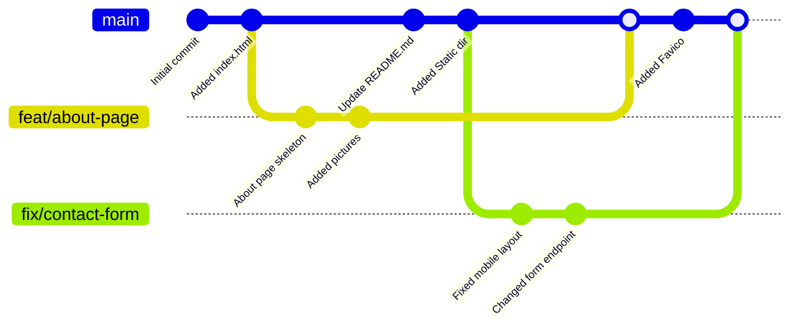

---
title: Git Collab 101
description: Opinionated tutorial on how to collaborate in a dev project.
date: '12/26/2024'
icon: https://git-scm.com/images/logos/downloads/Git-Icon-1788C.png
author: Kalitsune
tags:
  - git
  - dev
published: true
---
## Introduction

Recently, I collaborated on a development project with a few friends. While some of us were seasoned Git users, others had never used it outside of solo repositories. This led to some confusion and inefficiencies. To bridge this gap and help others who might be in a similar situation, I've created this blog post to explain some basic principles of Git collaboration.

## Prerequisites

To get the most out of this article, you'll ideally have:

- Basic Git knowledge and experience
- A Git repository set up
- A team of collaborators (but hey, even solo developers can benefit from using branches effectively!)

## Branches

### Why Use Branches?

Git is a powerful tool, but working on a single repository with multiple people can lead to conflicts, especially if multiple people modify the same files simultaneously. This can become a real headache!

Branches are the solution to this problem. They allow you to create isolated environments to work on specific features or bug fixes. Think of a branch as a copy of your main codebase where you can experiment and make changes without affecting the original code.

Here's a good rule of thumb: create a separate branch for each feature you implement (with the exception of minor, one-time changes).

### What Are Branches?

Branches are essentially snapshots of your code at a specific point in time. They provide a safe space to develop new features or fix bugs without jeopardizing the stability of your main codebase.

Here's a visualization of a Git repository effectively utilizing branches:

### Naming Branches

As you might have noticed in the previous example, each branch was prefixed with a word that describes the nature of the changes made. Here are some commonly used prefixes:

- `fix/`: Used for branches that address bug fixes.
- `feat/`: Used for branches that introduce new features.

You can also use additional prefixes like `docs/` for documentation changes or `release/` for preparing releases. However, it's best to keep the number of prefixes manageable to avoid confusion.

The second part of the branch name should be a concise description of the change using lowercase letters and hyphens to separate words (e.g., `feat/add-user-login`).

### People and Branches

The primary purpose of branches is to organize your work and prevent developers from making conflicting changes. To achieve this effectively, it's recommended to minimize the number of developers working on the same branch simultaneously.

If multiple developers need to contribute to a complex feature, consider splitting the task into smaller, more manageable branches. Alternatively, some developers can work on other features while others focus on the congested branch.

Effective communication is crucial when working on the same branch. Team members should keep each other informed of changes made to avoid conflicts.

## Naming Commits

Commit messages should be **short** and **descriptive**. They should clearly convey the purpose of the changes you've made.

Here are some examples of good and bad commit messages:

**Good Commit Messages:**

- ✅ `Tweaked the submit button's color`
- ✅ `Updated the code license`

**Bad Commit Messages:**

- ❌ `V1.0.0` (This doesn't provide any meaningful information about the changes.)
- ❌ `commit 1` (This is vague and unhelpful.)
- ❌ `Update Program.c` (This is too generic.)
- ❌ `a` (This is meaningless.)

**Tip:** Use the commit description field to provide more details about your changes.

**Spice up your commits with emojis!** You can use emojis at the beginning of your commit messages to add a touch of personality and indicate the type of change (e.g., bug fix, new feature, documentation update). Here are some examples:

- `🎉 feat: Implemented user registration functionality`
- `🐛 fix: Resolved bug in contact form validation`
- `📝 docs: Updated API documentation`
